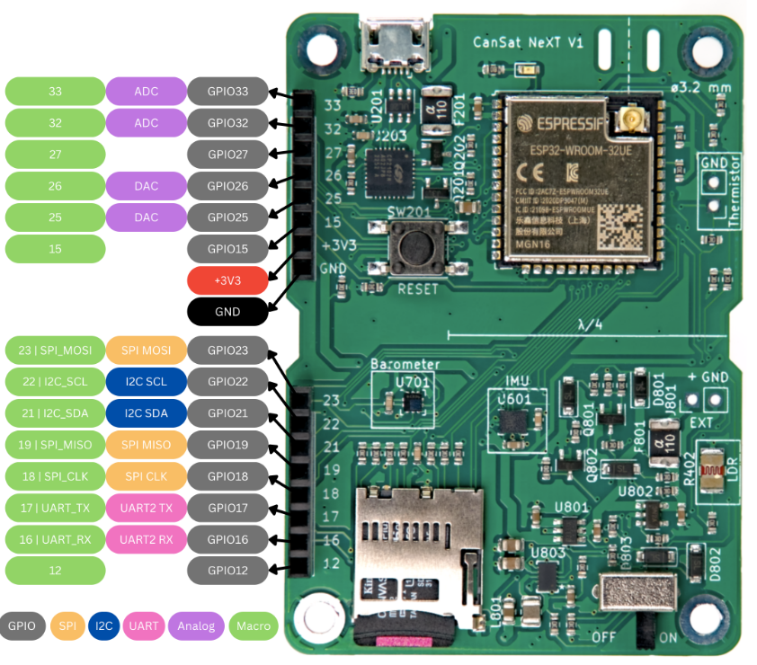

.. _getting_started:

Getting started
===============

.. warning::

   This documentation is **deprecated**. For newest CanSat NeXT documentation, see https://www.cansat.fi/docs/landing .

.. _setup:

Setup
-----

Required Software
*****************

* Arduino IDE: https://www.arduino.cc/en/software
* CanSat NeXT Arduino library: https://github.com/netnspace/CanSatNeXT_library
* ESP32 support (available from Arduino IDE's Boards Manager from https://raw.githubusercontent.com/espressif/arduino-esp32/gh-pages/package_esp32_index.json )

Required Hardware
*****************

* `CanSat Kit <https://spacelabnextdoor.com/electronics/20-cansat-next>`_

The kit includes a CanSat, an antenna, and a ground segment radio for communication and data gathering.

* (Optional): `CanSat GPS Module <https://holvi.com/shop/kitsat/product/99579c7b559989fb4e61bc1e80f83e8b/>`_

https://github.com/netnspace/CanSatNeXT_GNSS

* (Optional): `CanSat Perf Board <https://holvi.com/shop/kitsat/product/955626e5622d5462fc0a2ff58b6cc8fe/>`_ for custom payload development

.. _step_by_step_installation:

Step-by-step installation
-------------------------

1. Install the Arduino IDE

* Download and install the Arduino IDE from the official website if you haven't already: https://www.arduino.cc/en/software

2. Install ESP32 Support

* Open the Arduino IDE.
* Navigate to Tools->Board->Boards Manager.
* In the search bar, type in "ESP32" and find the option provided by Espressif.
* Click "install" to add support to your Arduino IDE.

3. Install the CanSat NeXT Library
	
* In the Arduino IDE, go to Sketch -> Include Library -> Manage Libraries.
* In the search bar, type "CanSatNeXT" and find the corresponding library.
* Click "Install" to install the library. If the Arduino IDE asks if you want to install with dependencies - click yes.
* Alternatively, you can manually add the library by downloading this repository: https://github.com/netnspace/CanSatNeXT_library and saving it into the Arduino libraries folder on your computer.

4. Connect the CanSatNeXT Board.

* Plug the CanSat board to your PC with a USB cable.
* Your PC should automatically detect the board, but if it doesn't, you may need to install the necessary drivers.
* Drivers can be found on the Silicon Labs website: https://www.silabs.com/developers/usb-to-uart-bridge-vcp-drivers
* For additional help with setting up the ESP32, refer to the following tutorial: https://docs.espressif.com/projects/esp-idf/en/latest/esp32/get-started/establish-serial-connection.html

5. Get Started with the CanSatNeXT Board

* Once you have installed the Arduino IDE, ESP32 support, and the CanSatNeXT library (and possibly the drivers), you are ready to start using the board.
* To explore the use of the various hardware resources, go to File -> Examples -> CanSatNeXT in the Arduino IDE.

.. _example_scripts:

Example Scripts
---------------

LED Blink Example
*****************

.. code-block:: C++

	/*
	  This example shows the most basic things - print a message and blink the on-board LED.

	  If this doesn't work, it is most likely caused by one of these things
	  1. The computer doesn't detect the device - check that the driver is installed
	  2. Arduino doesn't have ESP32 installed. Install boards manager - esp32 by espressif, select ESP32 Dev Module
	*/
	// Include the CanSatNeXT library
	#include "CanSatNeXT.h"

	void setup() {
	  // Start the serial line to print data to the terminal
	  Serial.begin(115200);
	  // Start all CanSatNeXT on-board systems.
	  CanSatInit();
	}

	void loop() {
	  // Let's blink the LED
	  digitalWrite(LED, HIGH);
	  delay(100);
	  digitalWrite(LED, LOW);
	  delay(400);
	  Serial.println("This is a message!");
	}

See the :ref:`arduino_library` section for more coding examples.

Trouble with setup? Leave us a message: hello@cansat.fi
