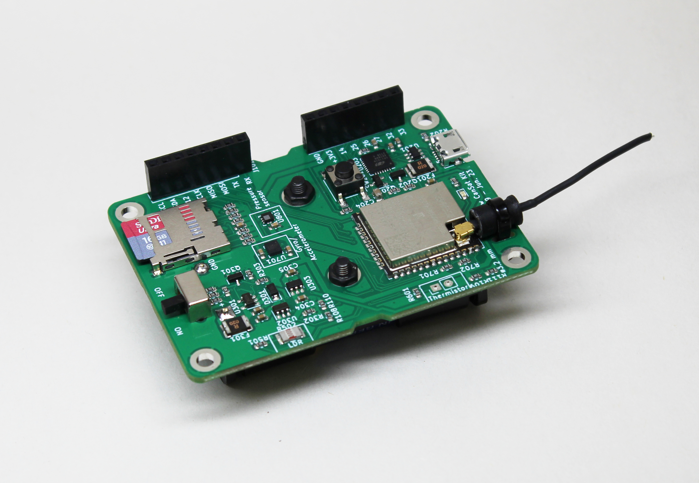

.. _getting_started:

Getting started
===============

**What is Cansat?**

The CanSat is a simulated satellite — integrated within the volume and shape of a soft drink can.

CanSat competitions provide an opportunity for students to design and build a simplified satellite system
and then test its functionality through a real-world launch scenario.

The aim of the CanSat project is to provide a cost-effective platform for students to gain hands-on experience in designing,
and operating a small-scale satellite-like system. This allows for practical application of concepts from engineering, electronics, while working
together with their classmates on a fun project.

For more information on CanSat, check out https://cansat.esa.int/ .

.. _setup:

Setup
-----

Required Software
*****************

* Arduino IDE: https://www.arduino.cc/en/software
* ESP32 pack (available from Arduino IDE's Boards Manager from https://raw.githubusercontent.com/espressif/arduino-esp32/gh-pages/package_esp32_index.json )
* CanSat software: https://github.com/nikandt/cansat

Required Hardware
*****************

* `CanSat Kit <https://holvi.com/shop/kitsat/product/e5b4aa56d0a5ffb5cf3d7b421b7a58cf/>`_

The kit includes a CanSat, an antenna, and a ground segment radio for communication and data gathering.

* (Optional): `CanSat GPS Module <https://holvi.com/shop/kitsat/product/99579c7b559989fb4e61bc1e80f83e8b/>`_

* (Optional): `CanSat Perf Board <https://holvi.com/shop/kitsat/product/955626e5622d5462fc0a2ff58b6cc8fe/>`_ for custom payload development

.. _step_by_step_installation:

Step-by-step installation
-------------------------

1. Download the required software (Arduino IDE): https://www.arduino.cc/en/software

2. Open Boards manager from Tools>Board>Board Manager. Type in "esp32" to the search. Install the latest ESP32 Boards package provided by Arduino.

3. Copy Cansat example scripts from https://github.com/nikandt/cansat/tree/main/example%20scripts to your PC.

4. Connect CanSat to your PC with a USB cable and open the led_blink/led_blink.ino file from example scripts with Arduino IDE.

5. From the top pane of Arduino IDE, choose "Select Board". Your Cansat should show up as an ESP32 device.

6. From the top pane, click "Upload" to flash the example code to your Cansat. Your Cansat board LEDs should now be blinking.

.. _example_scripts:

Example Scripts
---------------

Receiver example
****************

.. code-block:: C++

	#include <esp_now.h>
	#include "esp_wifi.h"
	#include <WiFi.h>

	uint8_t groundsationMAC[] = {0xD4, 0xD4, 0xDA, 0x5A, 0x5A, 0x74};

	void OnDataRecv(const uint8_t * mac, const uint8_t *incomingData, int len) {
	  Serial.write(incomingData, len);
	}
	 
	void setup() {
	  Serial.begin(921600);
	  WiFi.mode(WIFI_STA);
	  esp_wifi_set_mac(WIFI_IF_STA, &groundsationMAC[0]);

	  if (esp_now_init() != ESP_OK) {
		Serial.println("Error initializing ESP-NOW");
		return;
	  }
	  Serial.println("CANSAT GS Starting");
	  Serial.print("This GS MAC Address: ");
	  Serial.println(WiFi.macAddress());
	  esp_wifi_set_protocol( WIFI_IF_STA , WIFI_PROTOCOL_LR);   
	  esp_now_register_recv_cb(OnDataRecv);
	}
	 
	void loop() {

	}

See the :ref:`software` section for more coding examples.

Trouble with setup? Leave us a message: support@kitsat.fi